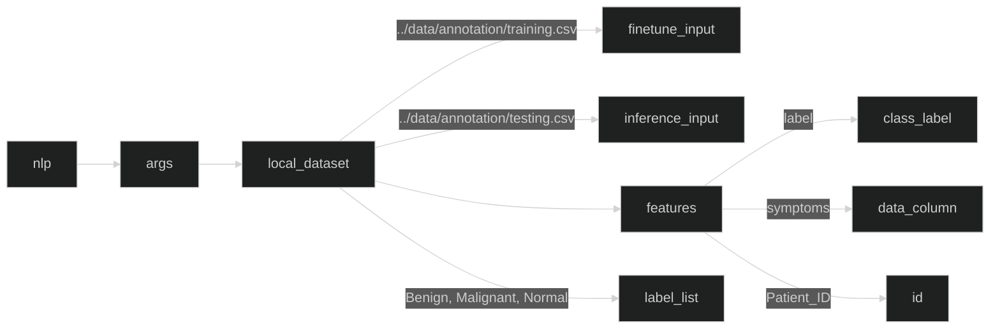
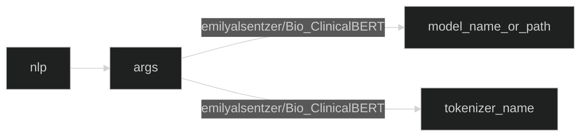

# Intel's Enhanced Multimodal Disease Prediction Reference Kit  

This blueprint is a one click refkit to provide an end-to-end solution on how to build a multimodal disease prediction detection model that will help to predict diagnosis by using categorized contrast enhanced mammography data and radiologists’ notes.’ Many reference kits in the bio-medical domain focus on a single-model and single-modal solution. Exclusive reliance on a single method has some limitations, such as impairing the design of robust and accurate classifiers for complex datasets. To overcome these limitations, we provide this multi-modal disease prediction reference kit.

## FLow
1. Click on `Use Blueprint` button.
2. You will be redirected to your blueprint flow page.
3. Go to the project settings section and update the configuration or leave as default to check on built-in demo. To change the dataset, model or training args please make the necessary changes in the corresponding config files.
4. Click on the `Run Flow` button.
5. The system will automatically download the dataset files, preprocess the data, finetune a Resnetv1.5 model and an NLP Model based on ClinicalBert models , runs infernce on images and notes and provides ensemble results.
6. Expected output is `all_results.csv and confusion matrix`. The results file provides the ensemble result of images and notes and indicates whether a patient has malignant , benign cancer or normal. 
 
## Solution Technical Overview
This reference kit demonstrates one possible reference implementation of a multi-model and multi-modal solution. While the vision workflow aims to train an image classifier that takes in contrast-enhanced spectral mammography (CESM) images, the natural language processing (NLP) workflow aims to train a document classifier that takes in annotation notes about a patient’s symptoms. Each pipeline creates prediction for the diagnosis of breast cancer. In the end, weighted ensemble method is used to create final prediction.

The goal is to minimize an expert’s involvement in categorizing samples as normal, benign, or malignant, by developing and optimizing a decision support system that automatically categorizes the CESM with the help of radiologist notes.


## Solution Technical Detail

- Uses real-world CESM breast cancer datasets with “multi-modal and multi-model” approaches.
- Two domain toolkits (Intel® Transfer Learning Toolkit and Intel® Extension for Transformers), Intel® Neural Compressor and other libs/tools and uses Hugging Face model repo and APIs for [ResNet-50](https://huggingface.co/microsoft/resnet-50) and [ClinicalBert](https://huggingface.co/emilyalsentzer/Bio_ClinicalBERT) models. 
- The NLP reference Implementation component uses [HF Fine-tuning and Inference Optimization workload](https://github.com/intel/intel-extension-for-transformers/tree/main/workflows/hf_finetuning_and_inference_nlp), which is optimized for document classification. This NLP workload employs Intel® Neural Compressor and other libraries/tools and utilizes Hugging Face model repository and APIs for ClinicalBert models. The ClinicalBert model, which is pretrained with a Masked-Language-Modeling task on a large corpus of English language from MIMIC-III data, is fine-tuned with the CESM breast cancer annotation dataset to generate a new BERT model.
- The Vision reference Implementation component uses [TLT-based vision workload](https://github.com/IntelAI/transfer-learning), which is optimized for image fine-tuning and inference. This workload utilizes Intel® Transfer Learning Tool and tfhub's ResNet-50 model to fine-tune a new convolutional neural network model with subtracted CESM image dataset. The images are preprocessed by using domain expert-defined segmented regions to reduce redundancies during training.
- Predict diagnosis by using categorized contrast enhanced mammography images and radiologists’ notes separately and weighted ensemble method applied to results of sub-models to create the final prediction.
The high-level architecture of the reference use case is shown in the diagram below. We use a credit card transaction dataset open-sourced by IBM (commonly known as the tabformer dataset) in this reference use case to demonstrate the capabilities outlined in the Solution Technical Overview section. 


### Task 1: Dataset Download
Downloads the CESM dataset, and segmented regions that are defined by domain experts to improve computational efficiency and reduce redundancies in the images. If user likes to provide a different dataset, please ensure data is stored in 'data' directory and has images in 'train_test_split_images' directory nlp notes in 'annotation' folder under data directory , with training_data.csv and testing_data.csv. These files contain notes about each patient accumulated together as csv files.
### Task 2: Vision Finetuning 
To fine-tune and inference the CESM images, the reference kit uses Transfer Learning Tool (TLT)-based vision workflow (TLTVW), which is optimized for image fine-tuning and inference, along with TensorFlow Hub’s ResNet-50 model, to fine-tune a new convolutional neural network model with the subtracted CESM image dataset. If the user would like to change any of the training args please make changes in the vision_finetune.yaml file. The results of this task is a vision model saved in 'output' directory 
### Task 3: NLP FineTuning
The reference kit uses the Hugging Face finetuning and Inference Optimization workflow (HFIOW) as a part of the Intel Extension for Transformers toolkit, which is specifically designed for document classification tasks. This natural language processing workflow uses several libraries/tools, including Intel Neural Compressor and Hugging Face model repository and Application Programming Interface (APIs) for ClinicalBert models. The ClinicalBert model, pretrained on a large English language corpus of MIMIC-III data using Masked-Language-Modeling task, is fine-tuned with the CESM breast cancer annotation dataset to generate a new BERT model, which is used for fine-tuning and inference of radiologist notes in the reference kit. If the user wants to change any training args please make modifications in nlp_finetune.yaml file
### Task 4: Ensemble Inference
After the models are trained and saved by task 3, load the NLP and vision models using the inference option. This applies a weighted ensemble method to generate a final prediction. To only run inference, set the 'inference' parameter to true in the 'disease_prediction_container.yaml' file and run the command provided in step 3.

## Performance
## Expected Output
A successful execution of inference returns the confusion matrix of the sub-models and ensembled model, as shown in these example results: 
```
------ Confusion Matrix for Vision model ------
           Benign  Malignant  Normal  Precision
Benign       18.0     11.000   1.000      0.486
Malignant     5.0     32.000   0.000      0.615
Normal       14.0      9.000  25.000      0.962
Recall        0.6      0.865   0.521      0.652

------ Confusion Matrix for NLP model ---------
           Benign  Malignant  Normal  Precision
Benign     25.000      4.000     1.0      0.893
Malignant   3.000     34.000     0.0      0.895
Normal      0.000      0.000    48.0      0.980
Recall      0.833      0.919     1.0      0.930

------ Confusion Matrix for Ensemble --------
           Benign  Malignant  Normal  Precision
Benign     26.000      4.000     0.0      0.897
Malignant   3.000     34.000     0.0      0.895
Normal      0.000      0.000    48.0      1.000
Recall      0.867      0.919     1.0      0.939
```
### How to customize this use case
Tunable configurations and parameters are exposed using yaml config files allowing users to change model training hyperparameters, datatypes, paths, and dataset settings without having to modify or search through the code.

#### Adopt to your dataset
To deploy this reference use case on a different or customized dataset, you can easily modify the disease_prediction_baremetal.yaml file. For instance, if you have a new text dataset, simply update the paths of finetune_input and inference_input and adjust the dataset features in the disease_prediction_baremetal.yaml file, as demonstrated below.



#### Adopt to your model

To implement this reference use case on a different or customized pre-training model, modifications to the disease_prediction_baremetal.yaml file are straightforward. For instance, to use an alternate model, one can update the path of the model by modifying the 'model_name_or_path' and 'tokenizer_name' fields in the disease_prediction_baremetal.yaml file structure. The following example illustrates this process:


## Learn More
For more information or to read about other relevant workflow examples, see these guides and software resources:
- [Intel® AI Analytics Toolkit (AI Kit)](https://www.intel.com/content/www/us/en/developer/tools/oneapi/ai-analytics-toolkit.html)
- [Intel® Neural Compressor](https://github.com/intel/neural-compressor)
- [Intel® Extension for PyTorch](https://intel.github.io/intel-extension-for-pytorch/)
- [Intel® Transfer Learning Tool](https://github.com/IntelAI/models/tree/master/docs/notebooks/transfer_learning)
- [Intel® Extension for Transformers](https://github.com/intel/intel-extension-for-transformers)


## Support
The end-to-end multi-modal disease prediction tea tracks both bugs and enhancement requests using [disease prediction GitHub repo](https://github.com/intel/disease-prediction). We welcome input, however, before filing a request, search the GitHub issue database. 

\*Other names and brands may be claimed as the property of others.
[Trademarks](https://www.intel.com/content/www/us/en/legal/trademarks.html).

---

*Disclaimer: This reference implementation shows how to train a model to examine and evaluate a diagnostic theory and the associated performance of Intel technology solutions using very limited, non-diverse datasets to train the model. The model was not developed with any intention of clinical deployment and therefore lacks the requisite breadth and depth of quality information in its underlying datasets, or the scientific rigor necessary to be considered for use in actual diagnostic applications. Accordingly, while the model may serve as a foundation for additional research and development of more robust models, Intel expressly recommends and requests that this model not be used in clinical implementations or as a diagnostic tool.*