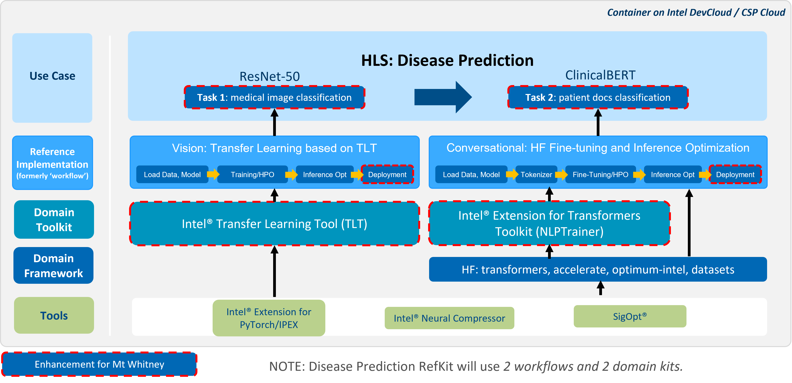
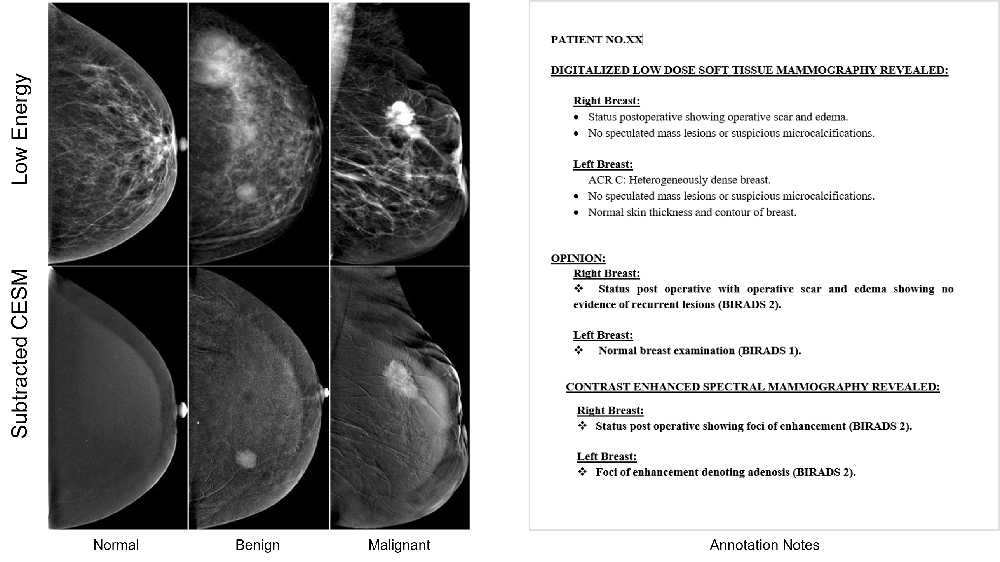
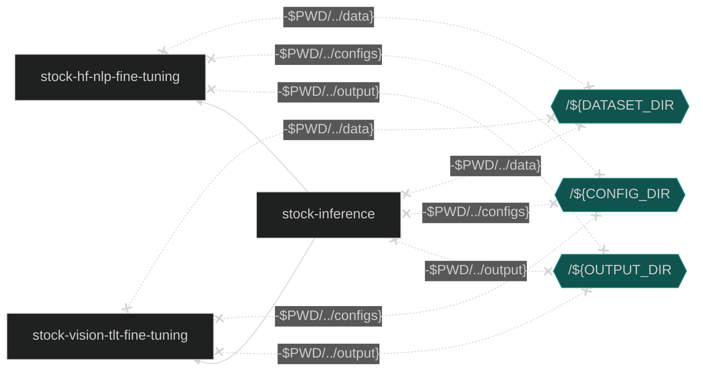
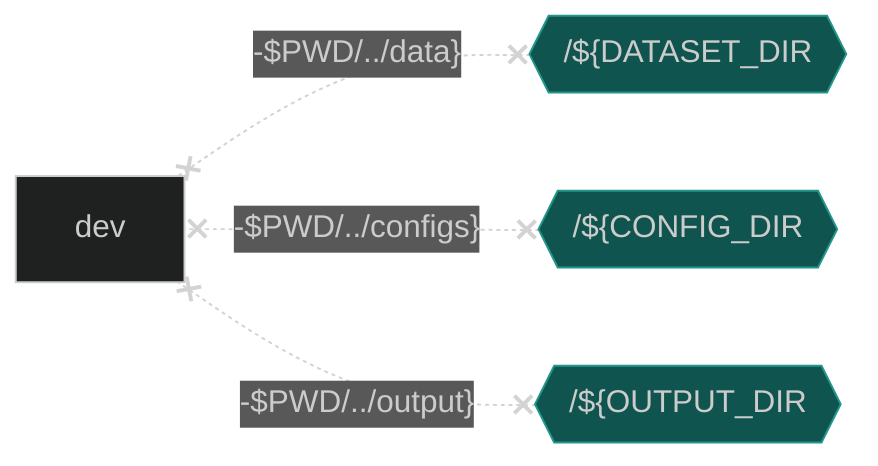

# Multi-Modal Disease Prediction
Many reference kits  in the bio-medical domain focus on a single-model and single-modal solution. Exclusive reliance on a single method has some limitations, such as impairing the design of robust and accurate classifiers for complex datasets. To overcome these limitations, we provide this multi-modal disease prediction reference kit.

Multi-modal disease prediction is an Intel  optimized, end-to-end reference kit for fine-tuning and inference. This reference kit implements a multi-model and multi-modal solution that will help to predict diagnosis by using categorized contrast enhanced mammography data and radiologists’ notes.
 
## **Table of Contents**
- [Overview](#overview)
- [Validated Hardware Details](#validated-hardware-details)
- [Software Requirements](#software-requirements)
- [How it Works?](#how-it-works)
    - [Architecture](#architecture)
    - [Pretraining of the ClinicalBERT Model](#pretraining-of-the-clinicalbert-model)
- [Get Started](#get-started)
- [Run Using Docker](#run-using-docker)
- [Run Using Argo Workflows on K8s using Helm](#run-using-argo-workflows-on-k8s-using-helm)
- [Run Using Bare Metal](#run-using-bare-metal) 
- [Run Using Jupyter Workspace](#run-using-jupyter-workspace)
- [Expected Output](#expected-output)
- [Summary and Next Steps](#summary-and-next-steps)
- [Learn More](#learn-more)
- [Support](#support)

## Overview
This reference kit demonstrates one possible reference implementation of a multi-model and multi-modal solution. While the vision workflow aims to train an image classifier that takes in contrast-enhanced spectral mammography (CESM) images, the natural language processing (NLP) workflow aims to train a document classifier that takes in annotation notes about a patient’s symptoms. Each pipeline creates prediction for the diagnosis of breast cancer. In the end, weighted ensemble method is used to create final prediction.

The goal is to minimize an expert’s involvement in categorizing samples as normal, benign, or malignant, by developing and optimizing a decision support system that automatically categorizes the CESM with the help of radiologist notes.

## Validated Hardware Details
There are workflow-specific hardware and software setup requirements depending on how the workflow is run. Bare metal development system and Docker image running locally have the same system requirements. 

| Recommended Hardware         | Precision  |
| ---------------------------- | ---------- |
| Intel® 4th Gen Xeon® Scalable Performance processors| FP32, BF16 |
| Intel® 1st, 2nd, 3rd, and 4th Gen Xeon® Scalable Performance processors| FP32 |

To execute the reference solution presented here, please use CPU for fine tuning. 

## Software Requirements 
Linux OS (Ubuntu 22.04) is used in this reference solution. Make sure the following dependencies are installed.

1. `sudo apt update`
2. `sudo apt install -y build-essential gcc git libgl1-mesa-glx libglib2.0-0 python3-dev`
3. Python3.9, Pip/Conda and python3.9-venv

## How It Works?
### Architecture

*Figure-1: Architecture of the reference kit* 

- Uses real-world CESM breast cancer datasets with “multi-modal and multi-model” approaches.
- Two domain toolkits (Intel® Transfer Learning Toolkit and Intel® Extension for Transformers), Intel® Neural Compressor and other libs/tools and uses Hugging Face model repo and APIs for [ResNet-50](https://huggingface.co/microsoft/resnet-50) and [ClinicalBert](https://huggingface.co/emilyalsentzer/Bio_ClinicalBERT) models. 
- The NLP reference Implementation component uses [HF Fine-tuning and Inference Optimization workload](https://github.com/intel/intel-extension-for-transformers/tree/main/workflows/hf_finetuning_and_inference_nlp), which is optimized for document classification. This NLP workload employs Intel® Neural Compressor and other libraries/tools and utilizes Hugging Face model repository and APIs for ClinicalBert models. The ClinicalBert model, which is pretrained with a Masked-Language-Modeling task on a large corpus of English language from MIMIC-III data, is fine-tuned with the CESM breast cancer annotation dataset to generate a new BERT model.
- The Vision reference Implementation component uses [TLT-based vision workload](https://github.com/IntelAI/transfer-learning), which is optimized for image fine-tuning and inference. This workload utilizes Intel® Transfer Learning Tool and tfhub's ResNet-50 model to fine-tune a new convolutional neural network model with subtracted CESM image dataset. The images are preprocessed by using domain expert-defined segmented regions to reduce redundancies during training.
- Predict diagnosis by using categorized contrast enhanced mammography images and radiologists’ notes separately and weighted ensemble method applied to results of sub-models to create the final prediction.

## Get Started
### Download the Reference Kit Repository
Create a working directory for the reference kit and clone the [Breast Cancer Prediction Reference Kit](https://github.com/intel/disease-prediction) repository into your working directory.
```
git clone https://github.com/intel/disease-prediction.git brca_multimodal
cd brca_multimodal
```

### DataSet
The dataset is a collection of 2,006 high-resolution contrast-enhanced spectral mammography (CESM) images (1003 low energy images and 1003 subtracted CESM images) with annotations of 326 female patients. See Figure-1. Each patient has 8 images, 4 representing each side with two views (Top Down looking and Angled Top View) consisting of low energy and subtracted CESM images. Medical reports, written by radiologists, are provided for each case along with manual segmentation annotation for the abnormal findings in each image. As a preprocessing step, we segment the images based on the manual segmentation to get the region of interest and group annotation notes based on the subject and breast side. 

  

*Figure-2: Samples of low energy and subtracted CESM images and Medical reports, written by radiologists from the Categorized contrast enhanced mammography dataset. [(Khaled, 2022)](https://www.nature.com/articles/s41597-022-01238-0)*

For more details of the dataset, visit the wikipage of the [CESM](https://wiki.cancerimagingarchive.net/pages/viewpage.action?pageId=109379611#109379611bcab02c187174a288dbcbf95d26179e8) and read [Categorized contrast enhanced mammography dataset for diagnostic and artificial intelligence research](https://www.nature.com/articles/s41597-022-01238-0).

#### Setting Up the Data
Use the links below to download the image datasets.

- [High-resolution Contrast-enhanced spectral mammography (CESM) images](https://faspex.cancerimagingarchive.net/aspera/faspex/external_deliveries/260?passcode=5335d2514638afdaf03237780dcdfec29edf4238#)

Copy all the downloaded files into the *data* directory.

**Note:** See this dataset's applicable license for terms and conditions. Intel Corporation does not own the rights to this dataset and does not confer any rights to it.

## Ways to run this reference use case
This reference kit offers three options for running the fine-tuning and inference processes:

- Docker
- Argo Workflows on K8s Using Helm
- Bare Metal
- Jupyter Workspace 

Details about each of these methods can be found below.

## Run Using Docker
Follow these instructions to set up and run our provided Docker image. For running on bare metal, see the [bare metal](#run-using-bare-metal) instructions.

### 1. Set Up Docker Engine and Docker Compose
You'll need to install Docker Engine on your development system. Note that while **Docker Engine** is free to use, **Docker Desktop** may require you to purchase a license. See the [Docker Engine Server installation instructions](https://docs.docker.com/engine/install/#server) for details.


To build and run this workload inside a Docker Container, ensure you have Docker Compose installed on your machine. If you don't have this tool installed, consult the official [Docker Compose installation documentation](https://docs.docker.com/compose/install/linux/#install-the-plugin-manually).


```bash
DOCKER_CONFIG=${DOCKER_CONFIG:-$HOME/.docker}
mkdir -p $DOCKER_CONFIG/cli-plugins
curl -SL https://github.com/docker/compose/releases/download/v2.7.0/docker-compose-linux-x86_64 -o $DOCKER_CONFIG/cli-plugins/docker-compose
chmod +x $DOCKER_CONFIG/cli-plugins/docker-compose
docker compose version
```

### 2. Install Vision Packages and Intel TensorFlow Toolkit
Ensure you have completed steps in the [Get Started Section](#get-started).

### 3. Set Up Docker Image
Checkout the submodules.

```bash
git submodule update --init --recursive
cd docker
```

Build or Pull the provided docker image.
```bash
USER_CONSENT=y docker compose build
```
OR
```bash
docker pull intel/ai-workflows:beta-hf-nlp-disease-prediction
docker pull intel/ai-workflows:beta-vision-tlt-disease-prediction
docker pull intel/ai-workflows:beta-disease-prediction
```

### 4. Preprocess Dataset with Docker Compose
Prepare dataset for Disease Prediction workflows and accept the legal agreement to use the Intel Dataset Downloader.

```bash
USER_CONSENT=y docker compose run preprocess
```

**Note:** 
Preprocessing Script Initialization: Essential Steps Prior to the First Execution

To ensure a smooth and error-free experience, please follow these steps after completing the preprocessing stage. These steps are necessary to address any potential issues and ensure optimal functionality during the initial run. Run the following steps after preprocessing:
```bash
# This will run the entire use case pipeline
CONFIG=disease_prediction_baremetal docker compose run dev
git checkout ../configs
```

| Environment Variable Name | Default Value | Description |
| --- | --- | --- |
| DATASET_DIR | `$PWD/../data` | Unpreprocessed dataset directory |
| USER_CONSENT | n/a | Consent to legal agreement | <!-- TCE: Please help me word this better -->

### 5. Run Pipeline with Docker Compose

Both NLP and Vision Fine-tuning containers must complete successfully before the Inference container can begin. The Inference container uses checkpoint files created by both the nlp and vision fine-tuning containers stored in the `${OUTPUT_DIR}` directory to complete inferencing tasks.




Run entire pipeline to view the logs of different running containers.

```bash
cd docker
docker compose run stock-inference &
```

| Environment Variable Name | Default Value | Description |
| --- | --- | --- |
| CONFIG | `disease_prediction_container` | Config file name |
| CONFIG_DIR | `$PWD/../configs` | Disease Prediction Configurations directory |
| DATASET_DIR | `$PWD/../data` | Preprocessed dataset directory |
| OUTPUT_DIR | `$PWD/../output` | Logfile and Checkpoint output |

#### View Logs
Follow logs of each individual pipeline step using the commands below:

```bash
docker compose logs stock-vision-tlt-fine-tuning -f
docker compose logs stock-hf-nlp-fine-tuning -f
```

To view inference logs
```bash
fg
```

### 6. Run One Workflow with Docker Compose
Create your own script and run your changes inside of the container or run inference without waiting for fine-tuning.



Run using Docker Compose.

```bash
cd docker
docker compose run dev
```

| Environment Variable Name | Default Value | Description |
| --- | --- | --- |
| CONFIG | `disease_prediction_container` | Config file name |
| CONFIG_DIR | `$PWD/../configs` | Disease Prediction Configurations directory |
| DATASET_DIR | `$PWD/../data` | Preprocessed Dataset |
| OUTPUT_DIR | `$PWD/output` | Logfile and Checkpoint output |
| SCRIPT | `src/breast_cancer_prediction.py` | Name of Script |

#### Run Docker Image in an Interactive Environment

If your environment requires a proxy to access the internet, export your
development system's proxy settings to the docker environment:
```bash
export DOCKER_RUN_ENVS="-e ftp_proxy=${ftp_proxy} \
  -e FTP_PROXY=${FTP_PROXY} -e http_proxy=${http_proxy} \
  -e HTTP_PROXY=${HTTP_PROXY} -e https_proxy=${https_proxy} \
  -e HTTPS_PROXY=${HTTPS_PROXY} -e no_proxy=${no_proxy} \
  -e NO_PROXY=${NO_PROXY} -e socks_proxy=${socks_proxy} \
  -e SOCKS_PROXY=${SOCKS_PROXY}"
```

Run the workflow with the ``docker run`` command, as shown:

```bash
export CONFIG_DIR=$PWD/../configs
export DATASET_DIR=$PWD/../data
export OUTPUT_DIR=$PWD/../output
docker run -a stdout ${DOCKER_RUN_ENVS} \
           -v /$PWD/../hf_nlp:/workspace/hf_nlp \
           -v /$PWD/../vision_wf:/workspace/vision_wf \
           -v /${CONFIG_DIR}:/workspace/configs \
           -v /${DATASET_DIR}:/workspace/data \
           -v /${OUTPUT_DIR}:/workspace/output \
           --privileged --init -it --rm --pull always \
           intel/ai-workflows:beta-disease-prediction \
           bash
```

Run the command below for fine-tuning and inference:
```bash
python src/breast_cancer_prediction.py --config_file /workspace/configs/disease_prediction_baremetal.yaml
```

### 7. Clean Up Docker Containers
Stop containers created by docker compose and remove them.

```bash
docker compose down
```

## Run Using Argo Workflows on K8s Using Helm
### 1. Install Helm
- Install [Helm](https://helm.sh/docs/intro/install/)
```bash
curl -fsSL -o get_helm.sh https://raw.githubusercontent.com/helm/helm/main/scripts/get-helm-3 && \
chmod 700 get_helm.sh && \
./get_helm.sh
```
### 2. Setting up K8s
- Install [Argo Workflows](https://argoproj.github.io/argo-workflows/quick-start/) and [Argo CLI](https://github.com/argoproj/argo-workflows/releases)
- Configure your [Artifact Repository](https://argoproj.github.io/argo-workflows/configure-artifact-repository/)
- Ensure that your dataset and config files are present in your chosen artifact repository.
### 3. Install Workflow Template
```bash
export NAMESPACE=argo
helm install --namespace ${NAMESPACE} --set proxy=${http_proxy} disease-prediction ./chart
argo submit --from wftmpl/disease-prediction --namespace=${NAMESPACE}
```
### 4. View 
To view your workflow progress
```bash
argo logs @latest -f
```
## Run Using Bare Metal
### 1. Create Environment 

Users are encouraged to use python virtual environments for consistent package management

Using virtualenv:

```
python3.9 -m venv hls_env
source hls_env/bin/activate
```

Or conda: If you don't already have conda installed, see the [Conda Linux installation instructions](https://docs.conda.io/projects/conda/en/stable/user-guide/install/linux.html).
```
conda create --name hls_env python=3.9
conda activate hls_env
```

### 2. Install Required Workflows and Preprocess the Data
> Make sure [High-resolution Contrast-enhanced spectral mammography (CESM) images](https://faspex.cancerimagingarchive.net/aspera/faspex/external_deliveries/260?passcode=5335d2514638afdaf03237780dcdfec29edf4238#) are downloaded and copied into the *data* directory.

This step involves the installation of the following components:

- HF Fine-tune & Inference Optimization workflow
- Transfer Learning based on TLT workflow
- Model Zoo for Intel®

Upon successful installation, the data is preprocessed.

```
bash setup_workflows.sh
```

### 3. Model Building Process

To train the multi-model disease prediction, utilize the 'breast_cancer_prediction.py' script along with the arguments outlined in the 'disease_prediction_baremetal.yaml' configuration file, which has the following structure:

```
disease_prediction_baremetal.yaml
    
    |
    └──overwrite_training_testing_ids
    └──output_dir
    └──test_size
    └──write
    └──nlp
        |── finetune
        |── inference
        └── other parameters for HF fine-tune and inference optimization workflow
    └──vision
        |── finetune
        |── inference
        └── other parameters for HF fine-tune and inference optimization workflow
```

The 'disease_prediction_baremetal.yaml' file includes the following parameters:

- overwrite_training_testing_ids: uses previously created train and test data sets
- output_dir: specifies the location of the output model and inference results
- test_size: sets the percentage of the test data set
- write: a container parameter that is set to false for bare metal
- nlp:
  - finetune: runs nlp fine-tuning
  - inference: runs nlp inference
  - additional parameters for the HF fine-tune and inference optimization workflow (more information available [here](https://github.com/intel/intel-extension-for-transformers/tree/main/workflows/hf_finetuning_and_inference_nlp/config))

- vision:
  - finetune: runs vision fine-tuning
  - inference: runs vision inference
  - additional parameters for the Vision: Transfer Learning Toolkit based on TLT workflow (more information available [here](https://github.com/IntelAI/transfer-learning/tree/f2e83f1614901d44d0fdd66f983de50551691676/workflows/disease_prediction))


To solely perform the fine-tuning process, set the 'finetune' parameter to true in the 'disease_prediction.yaml' file and execute the following command:

```
python src/breast_cancer_prediction.py --config_file configs/disease_prediction_baremetal.yaml
```

### 4. Running Inference
After the models are trained and saved using the script from step 4, load the NLP and vision models using the inference option. This applies a weighted ensemble method to generate a final prediction. To only run inference, set the 'inference' parameter to true in the 'disease_prediction.yaml' file and run the command provided in step 4.

> Alternatively, you can combine the training and inference processes into one execution by setting both the 'finetune' and 'inference' parameters to true in the 'disease_prediction.yaml' file and running the command provided in step 4.

## Run Using Jupyter Workspace 
Jupyter: Empowering Efficient ML Development and Experimentation with Workspaces and Python SDK Integration

Harnessing the power of Jupyter, one of the most versatile tools for building and developing machine learning code, is made even more seamless with the inclusion of workspaces. With this feature, users can effortlessly leverage Jupyter backed by remote compute resources.

When the time comes to execute experiments that are diligently tracked by intel devcloud and cnvrg, the process is made simple through the utilization of the Python SDK. By leveraging this SDK, users can effortlessly initiate and monitor their experiments with ease.

Experience the freedom of a fully functional Jupyter workspace, where all you need is an open environment to unlock boundless possibilities in ML development and experimentation.

Open [Jupyter workspace](https://cnvrg-job-notebooksession-zt6vn4x1ncy4adehyydu-11-jupyter.auqfmwbs3joskpufhcd5bbv.cloud.cnvrg.io/lab/workspaces/auto-4/tree/demo_files/brca_multimodal_notebook_inference.ipynb)


## Expected Output
A successful execution of inference returns the confusion matrix of the sub-models and ensembled model, as shown in these example results: 
```
------ Confusion Matrix for Vision model ------
           Benign  Malignant  Normal  Precision
Benign       18.0     11.000   1.000      0.486
Malignant     5.0     32.000   0.000      0.615
Normal       14.0      9.000  25.000      0.962
Recall        0.6      0.865   0.521      0.652

------ Confusion Matrix for NLP model ---------
           Benign  Malignant  Normal  Precision
Benign     25.000      4.000     1.0      0.893
Malignant   3.000     34.000     0.0      0.895
Normal      0.000      0.000    48.0      0.980
Recall      0.833      0.919     1.0      0.930

------ Confusion Matrix for Ensemble --------
           Benign  Malignant  Normal  Precision
Benign     26.000      4.000     0.0      0.897
Malignant   3.000     34.000     0.0      0.895
Normal      0.000      0.000    48.0      1.000
Recall      0.867      0.919     1.0      0.939

```


## Summary and Next Steps
This Github repo describes a reference kit for multi-modal disease prediction in the biomedical domain. The kit provides an end-to-end solution for fine-tuning and inference using categorized contrast-enhanced mammography data and radiologists' notes to predict breast cancer diagnosis. The reference kit includes a vision workload that trains an image classifier using CESM images, and a NLP pipeline that trains a document classifier using annotation notes about a patient's symptoms. Both pipelines create predictions for the diagnosis of breast cancer, which are then combined using a weighted ensemble method to create a final prediction. The ultimate goal of the reference kit is to develop and optimize a decision support system that can automatically categorize samples as normal, benign, or malignant, thereby reducing the need for expert involvement.

As a future work, we will use a postprocessing method that will ensemble the different domain knowledge at feature level and fine-tune a model that would increase the accuracy of the prediction, speed up the end-to-end execution time for fine-tuning and inference, and reduce the cost of computation.  

### How to customize this use case
Tunable configurations and parameters are exposed using yaml config files allowing users to change model training hyperparameters, datatypes, paths, and dataset settings without having to modify or search through the code.

#### Adopt to your dataset
To deploy this reference use case on a different or customized dataset, you can easily modify the disease_prediction_baremetal.yaml file. For instance, if you have a new text dataset, simply update the paths of finetune_input and inference_input and adjust the dataset features in the disease_prediction_baremetal.yaml file, as demonstrated below.

```
|
└──nlp # HF Fine-tuning and Inference Optimization workload
    |── args
        |──local_dataset
            |── finetune_input: '../data/annotation/trainig.csv'
            |── inference_input: '../data/annotation/testing.csv'
            |── features
              |── class_label: "label"  # Label column name.
              |── data_column: "symptoms" # Data column name
              |── id: "Patient_ID" # Id column name
            |── label_list: ["Benign", "Malignant", "Normal"] # List of class labels
```    

#### Adopt to your model

To implement this reference use case on a different or customized pre-training model, modifications to the disease_prediction_baremetal.yaml file are straightforward. For instance, to use an alternate model, one can update the path of the model by modifying the 'model_name_or_path' and 'tokenizer_name' fields in the disease_prediction_baremetal.yaml file structure. The following example illustrates this process:

```
|
└──nlp # HF Fine-tuning and Inference Optimization workload
    |── args
        |── model_name_or_path: "emilyalsentzer/Bio_ClinicalBERT" # Path to pretrained model
        |── tokenizer_name: "emilyalsentzer/Bio_ClinicalBERT" # Pretrained tokenizer name
```


## Learn More
For more information or to read about other relevant workflow examples, see these guides and software resources:
- [Intel® AI Analytics Toolkit (AI Kit)](https://www.intel.com/content/www/us/en/developer/tools/oneapi/ai-analytics-toolkit.html)
- [Intel® Neural Compressor](https://github.com/intel/neural-compressor)
- [Intel® Extension for PyTorch](https://intel.github.io/intel-extension-for-pytorch/)
- [Intel® Transfer Learning Tool](https://github.com/IntelAI/models/tree/master/docs/notebooks/transfer_learning)
- [Intel® Extension for Transformers](https://github.com/intel/intel-extension-for-transformers)

## Support
The end-to-end multi-model disease prediction tea tracks both bugs and enhancement requests using [disease prediction GitHub repo](https://github.com/intel/disease-prediction). We welcome input, however, before filing a request, search the GitHub issue database. 
