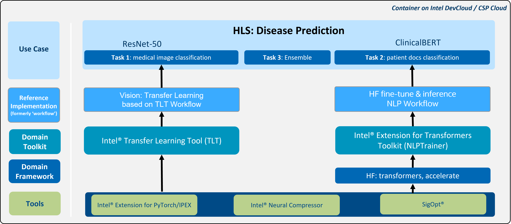

# Multi-Modal Disease Prediction
Many reference kits  in the bio-medical domain focus on a single-model and single-modal solution. Exclusive reliance on a single method has some limitations, such as impairing the design of robust and accurate classifiers for complex datasets. To overcome these limitations, we provide this multi-modal disease prediction reference kit.

Multi-modal disease prediction is an Intel  optimized, end-to-end reference kit for fine-tuning and inference. This reference kit implements a multi-model and multi-modal solution that will help to predict diagnosis by using categorized contrast enhanced mammography data and radiologists’ notes.
 

## **Table of Contents**
- [Overview](#overview)
- [Hardware Requirements](#hardware-requirements)
- [Software Requirements](#software-requirements)
- [How it Works?](#how-it-works)
    - [Architecture](#architecture)
    - [Pretraining of the ClinicalBERT Model](#pretraining-of-the-clinicalbert-model)
- [Get Started](#get-started)
- [Run Using Docker](#run-using-docker)
- [Run Using Argo Workflows on K8s using Helm](#run-using-argo-workflows-on-k8s-using-helm)
- [Run Using Bare Metal](#run-using-bare-metal) 
- [Expected Output](#expected-output)
- [Summary and Next Steps](#summary-and-next-steps)
- [Learn More](#learn-more)
- [Support](#support)


## Overview
This reference kit demonstrates one possible reference implementation of a multi-model and multi-modal solution. While the vision pipeline aims to train an image classifier that takes in contrast-enhanced spectral mammography (CESM) images, the natural language processing (NLP) pipeline aims to train a document classifier that takes in annotation notes about a patient’s symptoms. Each pipeline creates prediction for the diagnosis of breast cancer. In the end, weighted ensemble method is used to create final prediction.

The goal is to minimize an expert’s involvement in categorizing samples as normal, benign, or malignant, by developing and optimizing a decision support system that automatically categorizes the CESM with the help of radiologist notes.

## Hardware Requirements
There are workflow-specific hardware and software setup requirements depending on how the workflow is run. Bare metal development system and Docker image running locally have the same system requirements. 

| Recommended Hardware         | Precision  |
| ---------------------------- | ---------- |
| Intel® 4th Gen Xeon® Scalable Performance processors| FP32, BF16 |
| Intel® 1st, 2nd, 3rd, and 4th Gen Xeon® Scalable Performance processors| FP32 |

To execute the reference solution presented here, please use CPU for fine tuning, GPU for pretraining. 

## Software Requirements 
Linux OS (Ubuntu 20.04) is used in this reference solution. Make sure the following dependencies are installed.
```
sudo apt update 
sudo apt install -y gcc libgl1-mesa-glx libglib2.0-0
```


## How It Works?
### Architecture



- Uses real-world CESM breast cancer datasets with “multi-modal and multi-model” approaches.
- Two domain toolkits (Intel® Transfer Learning Toolkit and Intel® Extension for Transformers), Intel® Neural Compressor and other libs/tools and uses Hugging Face model repo and APIs for [ResNet-50](https://huggingface.co/microsoft/resnet-50) and [ClinicalBert](https://huggingface.co/emilyalsentzer/Bio_ClinicalBERT) models. 
- Uses Hugging face’s [ClinicalBert](https://huggingface.co/emilyalsentzer/Bio_ClinicalBERT) model with Masked-Language-Modeling task pretrained using large corpus of English language from PubMed data to fine tune a new BERT model with CESM breast cancer annotation dataset.
- Uses tfhub’s [ResNet-50](https://tfhub.dev/tensorflow/resnet_50/classification/1) model to fine tune a new convolutional neural network model with subtracted CESM image dataset. To reduce the redundancies in the images, only segmented regions (defined by the domain experts) are used for training.
- Predict diagnosis by using categorized contrast enhanced mammography images and radiologists’ notes separately and weighted ensemble method applied to results of sub-models to create the final prediction.


### Pretraining of the ClinicalBERT Model
Several BERT adaptations have been proposed to increase the performance of the model in the biomedical domain. BioBERT is pretrained by using the BERT model on PubMed abstracts and PubMed Central (PMC ) full-length articles. Additionally, ClinicalBERT is further pretrained by using the BioBERT on MIMIC-III clinical notes as a sub-domain adaptation. To further enhance the performance of the model, ClinicalBERT is fine-tuned with case specific dataset, such as contrast-enhanced spectral mammography (CESM) dataset. Details of the process can be found [here](clinicalbert_pretraining/README.md). 


## Get Started
### Download the Workflow Repository
Create a working directory for the workflow and clone the [Breast Cancer Prediction Workflow](https://github.com/intel/disease-prediction) repository into your working directory.
```
git clone https://github.com/intel/disease-prediction.git brca_multimodal
cd brca_multimodal
```

### DataSet
The dataset is a collection of 2,006 high-resolution contrast-enhanced spectral mammography (CESM) images (1003 low energy images and 1003 subtracted CESM images) with annotations of 326 female patients. Each patient has 8 images, 4 representing each side with two views (Top Down looking and Angled Top View) consisting of low energy and subtracted CESM images. Medical reports, written by radiologists, are provided for each case along with manual segmentation annotation for the abnormal findings in each image. As a preprocessing step, we segment the images based on the manual annotations to get the region of interest. 

For more details of the dataset, visit the wikipage of the [CESM](https://wiki.cancerimagingarchive.net/pages/viewpage.action?pageId=109379611#109379611bcab02c187174a288dbcbf95d26179e8) and read [Categorized contrast enhanced mammography dataset for diagnostic and artificial intelligence research](https://www.nature.com/articles/s41597-022-01238-0).

#### Setting Up the Data
Use the links below to download the image datasets.

- [High-resolution Contrast-enhanced spectral mammography (CESM) images](https://faspex.cancerimagingarchive.net/aspera/faspex/external_deliveries/260?passcode=5335d2514638afdaf03237780dcdfec29edf4238#)

Run the comments below to download other datasets.

- Clinical annotation data files
```
wget -O "data/Medical reports for cases .zip" https://wiki.cancerimagingarchive.net/download/attachments/109379611/Medical%20reports%20for%20cases%20.zip?api=v2
```

- Radiology hand drawn segmentations
```
wget -O "data/Radiology_hand_drawn_segmentations_v2.csv" https://wiki.cancerimagingarchive.net/download/attachments/109379611/Radiology_hand_drawn_segmentations_v2.csv?api=v2
```

- Radiology manual annotations
```
wget -O "data/Radiology manual annotations.xlsx" https://wiki.cancerimagingarchive.net/download/attachments/109379611/Radiology%20manual%20annotations.xlsx?api=v2
```

Copy all the downloaded files into the *data* directory.

**Note:** See this dataset's applicable license for terms and conditions. Intel Corporation does not own the rights to this dataset and does not confer any rights to it.

## Ways to run this reference use case
This reference kit offers three options for running the fine-tuning and inference processes:

- Docker
- Argo Workflows on K8s Using Helm
- Bare Metal

Details about each of these methods can be found below.

## Run Using Docker
Follow these instructions to set up and run our provided Docker image. For running on bare metal, see the [bare metal](#run-using-bare-metal) instructions.

<!-- If possible, provide an estimate of time to set up and run the workflow using Docker on the recommended hardware. -->

### 1. Set Up Docker Engine and Docker Compose
You'll need to install Docker Engine on your development system. Note that while **Docker Engine** is free to use, **Docker Desktop** may require you to purchase a license. See the [Docker Engine Server installation instructions](https://docs.docker.com/engine/install/#server) for details.


To build and run this workload inside a Docker Container, ensure you have Docker Compose installed on your machine. If you don't have this tool installed, consult the official [Docker Compose installation documentation](https://docs.docker.com/compose/install/linux/#install-the-plugin-manually).


```bash
DOCKER_CONFIG=${DOCKER_CONFIG:-$HOME/.docker}
mkdir -p $DOCKER_CONFIG/cli-plugins
curl -SL https://github.com/docker/compose/releases/download/v2.7.0/docker-compose-linux-x86_64 -o $DOCKER_CONFIG/cli-plugins/docker-compose
chmod +x $DOCKER_CONFIG/cli-plugins/docker-compose
docker compose version
```

### 2. Install Vision Packages and Intel TensorFlow Toolkit
Ensure you have completed steps in the [Get Started Section](#get-started).

### 3. Set Up Docker Image
Build or Pull the provided docker image.

```bash
git clone https://github.com/IntelAI/transfer-learning.git vision/tlt_toolkit
bash vision/setup_vision_workflow.sh
cd docker
docker compose build preprocess
```
OR
```bash
docker pull intel/ai-workflows:eap-disease-prediction
```

### 4. Preprocess Dataset with Docker Compose
Prepare dataset for Disease Prediction Workflows.

```bash
cd docker
docker compose run preprocess
```

### 5. Run Pipeline with Docker Compose

Both NLP and Vision Fine-tuning containers must complete successfully before the Inference container can begin. The Inference container uses checkpoint files created by both the nlp and vision fine-tuning containers stored in the `${OUTPUT_DIR}` directory to complete inferencing tasks.


Run entire pipeline to view the logs of different running containers.

```bash
cd docker
docker compose run stock-inference &
```

| Environment Variable Name | Default Value | Description |
| --- | --- | --- |
| OUTPUT_DIR | `$PWD/output` | Logfile and Checkpoint output |

#### View Logs
Follow logs of each individual pipeline step using the commands below:

```bash
docker compose logs stock-vision-fine-tuning -f
docker compose logs stock-nlp-fine-tuning -f
```

To view inference logs
```bash
fg
```

### 6. Run One Workflow with Docker Compose
Create your own script and run your changes inside of the container or run inference without waiting for fine-tuning.


Run using Docker Compose.

```bash
cd docker
docker compose run dev
```

| Environment Variable Name | Default Value | Description |
| --- | --- | --- |
| DATASET_DIR | `$PWD/../data` | Preprocessed Dataset |
| OUTPUT_DIR | `$PWD/output` | Logfile and Checkpoint output |
| PARAMETER | `inference` | Script file parameter |
| SCRIPT | `hls_wrapper.py` | Name of Script |
| WORKSPACE | `$PWD/..` | Github Repository Location, must have some Python wrapper in root of directory |

#### Run Docker Image in an Interactive Environment

If your environment requires a proxy to access the internet, export your
development system's proxy settings to the docker environment:
```bash
export DOCKER_RUN_ENVS="-e ftp_proxy=${ftp_proxy} \
  -e FTP_PROXY=${FTP_PROXY} -e http_proxy=${http_proxy} \
  -e HTTP_PROXY=${HTTP_PROXY} -e https_proxy=${https_proxy} \
  -e HTTPS_PROXY=${HTTPS_PROXY} -e no_proxy=${no_proxy} \
  -e NO_PROXY=${NO_PROXY} -e socks_proxy=${socks_proxy} \
  -e SOCKS_PROXY=${SOCKS_PROXY}"
```

Run the workflow with the ``docker run`` command, as shown:

```bash
export DATASET_DIR=$PWD/../data
export OUTPUT_DIR=$PWD/output
export WORKSPACE=$PWD/..
docker run -a stdout ${DOCKER_RUN_ENVS} \
           -v ${DATASET_DIR}:/disease-prediction/data \
           -v ${OUTPUT_DIR}:/disease-prediction/output \
           -v ${WORKSPACE}:/disease-prediction \
           --privileged --init -it --rm --pull always \
           intel/ai-workflows:eap-disease-prediction \
           bash
```

Run the command below for fine-tuning and inference:
```bash
python hls_wrapper.py --nlp_finetune --vision_finetune --inference
```

### 7. Clean Up Docker Containers
Stop containers created by docker compose and remove them.

```bash
docker compose down
```

## Run Using Argo Workflows on K8s Using Helm
### 1. Install Helm
- Install [Helm](https://helm.sh/docs/intro/install/)
```bash
curl -fsSL -o get_helm.sh https://raw.githubusercontent.com/helm/helm/main/scripts/get-helm-3 && \
chmod 700 get_helm.sh && \
./get_helm.sh
```
### 2. Setting up K8s
- Install [Argo Workflows](https://argoproj.github.io/argo-workflows/quick-start/) and [Argo CLI](https://github.com/argoproj/argo-workflows/releases)
- Configure your [Artifact Repository](https://argoproj.github.io/argo-workflows/configure-artifact-repository/)
### 3. Install Workflow Template
```bash
export NAMESPACE=argo
helm install --namespace ${NAMESPACE} --set proxy=${http_proxy} disease-prediction ./chart
argo submit --from wftmpl/disease-prediction --namespace=${NAMESPACE}
```
### 4. View 
To view your workflow progress
```bash
argo logs @latest -f
```
## Run Using Bare Metal
### 1. Create Conda Environment 
```
conda create --name hls_env python=3.9
conda activate hls_env
```

### 2. Install Vision Packages and Intel TensorFlow Toolkit
```
git clone https://github.com/IntelAI/transfer-learning.git vision/tlt_toolkit
bash vision/setup_vision_workflow.sh
```

### 3. Install the NLP Packages
```
pip install -r nlp/requirements.txt
```

### 4. Preprocess the Data
After datasets are downloaded and copied into the *data* directory, run the following functions.

```
python data/prepare_nlp_data.py
python data/prepare_vision_data.py
```

### 5. Model Building Process
Train the multi-model disease prediction by running the hls_wrapper.py script. The hls_wrapper.py script takes the following arguments, as shown by running `python hls_wrapper.py –help`:

```
usage: hls_wrapper.py [-h] [--vision_finetune] [--vision_quantization] [--vision_epochs VISION_EPOCHS] [--nlp_finetune] [--nlp_bf16] [--nlp_quantization] [--nlp_epochs NLP_EPOCHS]
                      [--inference] [--vision_int8_inference] [--nlp_int8_inference]

This pipeline performs end-to-end multi-modal classification for breast cancer.

optional arguments:
  -h, --help            show this help message and exit
  --vision_finetune     Perform Vision Finetune
  --vision_quantization
                        Create quantized vision model.
  --vision_epochs VISION_EPOCHS
                        Number of training epochs.
  --nlp_finetune        Perform NLP Finetune
  --nlp_bf16            Apply bf16 data type.
  --nlp_quantization    Create quantized NLP model.
  --nlp_epochs NLP_EPOCHS
                        Number of training epochs..
  --inference           Perform Inference on Vision and NLP pipeline
  --vision_int8_inference
                        Perform INT8 Inference on Vision
  --nlp_int8_inference  Perform INT8 Inference on NLP

```

**_NOTE:_**  You can enable bf16 inference by setting the bf16 flag as shown below. Note that this flag MUST be enabled only on Intel® Fourth Gen Xeon® Scalable processors code named Sapphire Rapids that has bf16 training support and optimizations to use AMX, the latest ISA introduced in this family of processors.


#### Post Training Optimization with Intel® Neural Compressor

Model quantization is the practice of converting the FP32 weights in Deep Neural Networks to a lower precision, such as INT8 to accelerate computation time and reduce storage space of trained models.  This may be useful if latency and throughput are critical.  

Intel® Neural Compressor offers multiple algorithms and packages for quantizing trained models that can be found at https://github.com/intel/neural-compressor.  In this reference implementation, we include the nlp_quantization and vision_quantization flags that can be executed on the trained model from above to attempt accuracy-aware quantization via post-training dynamic quantization.


 *hls_wrapper.py* reads and preprocesses the data, trains a ClinicalBERT based NLP classifier and ResNet-50 based vision classifier and saves the model for future use.

```
python hls_wrapper.py --nlp_finetune --vision_finetune
```

### 6. Running Inference
After the models are trained and saved by using the script in step #6, use the inference option to load the NLP and vision models that apply a weighted ensemble method to create a final prediction. If you only want to run inference, then try:

```
python hls_wrapper.py --inference
```

Instead of running training (Step 5) and inference (Step 6) separately, as we've just shown, you can combine training and inference processes into one command:
```
python hls_wrapper.py --nlp_finetune --vision_finetune --inference
```


## Expected Output
A successful execution of inference returns the confusion matrix of the sub-models and ensembled model, as shown in these example results: 
```
------ Confusion Matrix for Vision model ------
           Benign  Malignant  Normal  Precision
Benign       18.0     11.000   1.000      0.486
Malignant     5.0     32.000   0.000      0.615
Normal       14.0      9.000  25.000      0.962
Recall        0.6      0.865   0.521      0.652

------ Confusion Matrix for NLP model ---------
           Benign  Malignant  Normal  Precision
Benign     25.000      4.000     1.0      0.893
Malignant   3.000     34.000     0.0      0.895
Normal      0.000      0.000    48.0      0.980
Recall      0.833      0.919     1.0      0.930

------ Confusion Matrix for Ensemble --------
           Benign  Malignant  Normal  Precision
Benign     26.000      4.000     0.0      0.897
Malignant   3.000     34.000     0.0      0.895
Normal      0.000      0.000    48.0      1.000
Recall      0.867      0.919     1.0      0.939

```

## Summary and Next Steps
This Github repo describes a reference kit for multi-modal disease prediction in the biomedical domain. The kit provides an end-to-end solution for fine-tuning and inference using categorized contrast-enhanced mammography data and radiologists' notes to predict breast cancer diagnosis. The reference kit includes a vision pipeline that trains an image classifier using contrast-enhanced spectral mammography (CESM) images, and a natural language processing (NLP) pipeline that trains a document classifier using annotation notes about a patient's symptoms. Both pipelines create predictions for the diagnosis of breast cancer, which are then combined using a weighted ensemble method to create a final prediction. The ultimate goal of the reference kit is to develop and optimize a decision support system that can automatically categorize samples as normal, benign, or malignant, thereby reducing the need for expert involvement.


## Learn More
For more information or to read about other relevant workflow examples, see these guides and software resources:
- [Intel® AI Analytics Toolkit (AI Kit)](https://www.intel.com/content/www/us/en/developer/tools/oneapi/ai-analytics-toolkit.html)
- [Intel® Neural Compressor](https://github.com/intel/neural-compressor)
- [Intel® Extension for PyTorch](https://intel.github.io/intel-extension-for-pytorch/)
- [Intel® Transfer Learning Tool](https://github.com/IntelAI/models/tree/master/docs/notebooks/transfer_learning)
- [Intel® Extension for Transformers](https://github.com/intel/intel-extension-for-transformers)


## Support
The end-to-end multi-model disease prediction tea tracks both bugs and enhancement requests using [disease prediction GitHub repo](https://github.com/intel/disease-prediction). We welcome input, however, before filing a request, search the GitHub issue database. 


