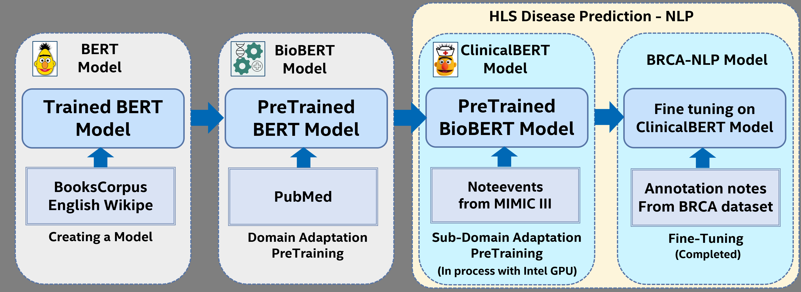

# Pretraining of the ClinicalBert workflow
This repo hosts pretraining and finetuning weights and relevant scripts for pretraining of ClinicalBERT by using Intel accelerators (GPU). The repo is created based on [ClinicalBERT](https://github.com/EmilyAlsentzer/clinicalBERT) repo. Only minimal changes (i.e version updates) were done from the original repo.  

 
## Overview

To increase the performance of the model in biomedical domain, several BERT adaptations for the biomedical domain have been proposed. BioBERT is pre-trained the BERT model on PubMed abstracts and PMC full-length articles. Additionally, ClinicalBERT is further pre-trained the BioBERT on MIMIC-III clinical notes as a sub-domain adaptation. To maximize the performance of the model, ClinicalBERT fine-tuned with use case specific dataset such as Contrast-enhanced spectral mammography dataset

 

## Hardware Requirements
Pretraining of ClinicalBERT is requires Aurora cluster. All environment settings described based on Aurora cluster. 

## How it works
The idea is to pretrain ClinicalBERT on [MIMIC-III v1.4](https://physionet.org/content/mimiciii/1.4/) dataset on Aurora PVC cluster. Current version of this repo uses single PVC on Aurora system.

## Get Started
- Aurora user access through [Intel Acccess Governance System](https://ags.intel.com/identityiq/home.jsf) (AGS). It requires to be connected to Intel VPN. 
- Reservations through https://btr-devops.intel.com/buster/schedreservations/ 

## Steps

### Code Location
```
cd bcra_multimodal/clinicalbert_pretraining  
```

### Proxy setup
Execute following commands in terminal to setup proxy.
```
declare -x http_proxy="http://proxy-us.intel.com:912"
declare -x https_proxy="http://proxy-us.intel.com:912"
```

### Conda environment setup.

```
cd clinicalBERT/lm_pretraining
conda env create -n clb_env -f clb_env.yaml
conda activate clb_env
```

### Install spacy model
```
pip install https://s3-us-west-2.amazonaws.com/ai2-s2-scispacy/releases/v0.5.1/en_core_sci_md-0.5.1.tar.gz
```

### MKL, driver loads (Module loads)
To setup tools/driver, run the commands below from terminal
```
module use -a /home/rsrirama/13feb_multimodal/dependencies/modulefiles
module unload oneapi mpich autotools prun ohpc oneapi-testing cmake graphics-compute-runtime gen_tools
module load oneapi-testing/2023.0.002.PUBLIC_ccl-gold-ww51     
module list
```
### Download Models for pretraining of Clinical BERT
- bert code is modified for compatiblity with tensorflow version.
- bert_pretrain_output_all_notes_150000 corresponds to Clinical BERT, and bert_pretrain_output_disch_100000 corresponds to Discharge Summary BERT. 
    - cd  bcra_multimodal/clinicalbert_pretraining  
    - wget -O pretrained_bert_tf.tar.gz https://www.dropbox.com/s/8armk04fu16algz/pretrained_bert_tf.tar.gz?dl=1
    - tar -xvf pretrained_bert_tf.tar.gz
    - cd pretrained_bert_tf/
    - tar -xvf biobert_pretrain_output_disch_100000.tar.gz
    - tar -xvf biobert_pretrain_output_all_notes_150000.tar.gz

### Dataset
[MIMIC-III v1.4](https://physionet.org/content/mimiciii/1.4/) dataset is used. Since MIMIC-III requires the CITI training program in order to use it, the data isn't a part of this repo. After completion of the CITI training program, download the noteevents.csv to bcra_multimodal/clinicalbert_pretraining/data folder. Pretraining of the ClinicalBERT uses all the categories in the noteevents.csv file.

### Logging on to Aurora node
- 'Aurora user' access can be gotten through AGS
 - Reservation to the nodes can be made through

      https://btr-devops.intel.com/buster/schedreservations/add/?machine_group_id=
- The nodes dont have network connectivity. This has to be done after the environment is setup.
- Commands to ssh to node
```
export SALLOC_RESERVATION=_username_
salloc -N 1 -t 300 -s # results of this comment provides the cluster name (i.e: c001n0001)
ssh _clustername_   
```

### Pretraining commands
Before executing below commands do ensure the conda environment is activated and the module load commands have been executed.
```
    - cd bcra_multimodal/clinicalbert_pretraining/clinicalBERT/lm_pretraining
    - python format_mimic_for_BERT.py --output_dir ../../outputs/tokenized_notes/ --output_file formatted_output.txt --mimic_notes_file ../../data/NOTEEVENTS.csv --category Discharge_Summary
            ○ Since pretraining of the ClinicalBERT uses all categories, default category value is None, 
            ○ Output is created in ../../outputs/tokenized_notes/
    - bash create_pretrain_data.sh
            ○ Output is created in ../../outputs/pretrained_data
    - bash finetune_lm_tf.sh
            ○ Final pre-trained checkpointed model Output is created in ../../outputs/clinical_bert_model/
```

### Code changes to from the original [ClinicalBERT](https://github.com/EmilyAlsentzer/clinicalBERT) repo
Few code changes were done to clinicalBert and Bert to adapt to updated Tensorflow environment. The changes are documented under [UPDATES.md](UPDATES.md)

### To monitor GPU activity
```
https://wiki.ith.intel.com/pages/viewpage.action?spaceKey=MLBA&title=Intel+GPU+TOP
```
